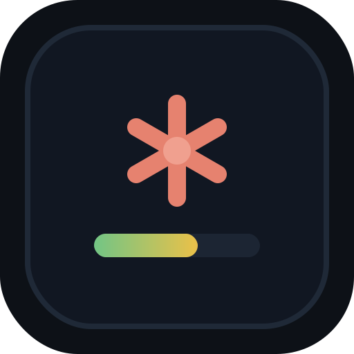
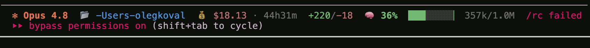

<p align="center">
  <a href="https://github.com/oleg-koval/glint/actions/workflows/ci.yml"></a>
  <a href="LICENSE"></a>
  
  
</p>

<p align="center">
  
</p>

<h1 align="center">glint</h1>

<p align="center">
  A rich, fast, fail-safe status line for <a href="https://docs.claude.com/en/docs/claude-code">Claude Code</a>.<br>
  <strong>Your whole session at a glance — with a live context gauge.</strong>
</p>

---

<p align="center">
  
</p>

Every Claude Code render, `glint` reads the session JSON and paints one tidy, colorful line: which model you're on, where you are, what it's costing, and — the part nobody else has — **how full your context window is, live, with a gradient gauge.** You see compaction coming instead of getting surprised by it.

One Python file. Zero dependencies. ~75 ms per render. Never crashes your status bar.

## Features

| Segment | Shows | Detail |
|---------|-------|--------|
| ✻ **Model** | `S4.6` | Active model, coral & bold, abbreviated to a family letter + version (`Sonnet 4.6` → `S4.6`, `Opus 4.8` → `O4.8`) |
| 📁 **Directory** | `my-repo` | Workspace basename, `~` for home |
| 🌿 **Git** | `main ●3 ↑1 ↓2` | Branch + uncommitted count + ahead/behind upstream. **Green when clean, yellow when dirty** |
| 💰 **Cost · time** | `$0.42 · 4m` | Session spend and duration. **Green < $1, gold < $5, red beyond** |
| **Lines** | `+1.2k/-340` | Lines added / removed this session, `k`-shortened |
| 🧠 **Context gauge** | `36% ▕███░░░░░▏ 357k/1.0M` | **Live** token usage. Gradient **green → yellow → red** as you fill up. When remaining budget drops to ≤30%, a bold `⚠ compact` badge appears so you compact before you're forced to |
| ⏱📅 **Rate limits** | `⏱5h 63%▕███░░▏ 📅7d 10%▕█░░░░▏` | Session (5h) and weekly (7d) rate-limit usage, same green → yellow → red gradient. Hidden if your plan doesn't report them |

Every segment is independent and **degrades gracefully** — no git repo hides the branch, no cost data hides the money, missing rate-limit data hides the bars. A hard failure falls back to a bare `✻ Claude` so your prompt is never blank.

## Installation

One line — downloads `glint.py` into `~/.claude` and wires the status line for you:

```bash
curl -fsSL https://raw.githubusercontent.com/oleg-koval/glint/main/install.sh | bash
```

Restart Claude Code (or start a new session) and it's live.

<details>
<summary>Manual install</summary>

```bash
# 1. grab the script
curl -fsSL https://raw.githubusercontent.com/oleg-koval/glint/main/glint.py -o ~/.claude/glint.py

# 2. point Claude Code at it — add this to ~/.claude/settings.json
#    "statusLine": { "type": "command", "command": "python3 \"/Users/you/.claude/glint.py\"" }
```
</details>

## How it works

Claude Code runs your `statusLine.command` on every render and pipes it a JSON blob describing the session ([docs](https://docs.claude.com/en/docs/claude-code/statusline)). `glint` parses that blob, runs a couple of sub-second `git` calls, and reads two more things:

- **Context gauge** — uses the payload's `context_window.used_percentage` / `context_window_size` directly when present. On older Claude Code versions without that field, it falls back to reading the **last main-thread assistant turn** from your transcript and summing its input-side tokens (`input + cache_creation + cache_read`). Sub-agent (sidechain) turns are skipped on purpose, so the gauge always reflects *your* context, never a delegate's.
- **Rate limit bars** — read straight from `rate_limits.five_hour` / `rate_limits.seven_day` when your plan reports them. There's no monthly window in the payload, so `glint` doesn't fabricate one.

## Configuration

`glint` is intentionally a single readable file — tweak it directly:

- **Colors** — the `# 256-color palette` block at the top maps every segment to an xterm-256 code.
- **Cost thresholds** — `money_color = GREEN if money < 1 else GOLD if money < 5 else RED`.
- **Context bands** — `gc = GREEN if pct < 0.6 else YELLOW if pct < 0.85 else RED`.
- **Compact threshold** — `if (100 - pct * 100) <= 30:` in the context gauge segment.
- **Gauge width** — the `width` arg of `gauge()`.
- **Icons** — emoji are used so they render on any terminal without a Nerd Font. Swap them for Nerd Font glyphs if you have one installed.

## Requirements

- **Claude Code** with status-line support
- **Python 3.8+** (standard library only — no `pip install`)
- **git** (optional; the branch segment simply hides without it)

## Uninstall

Remove the `"statusLine"` block from `~/.claude/settings.json` and delete `~/.claude/glint.py`.

## Why it's safe

- **No dependencies** — pure standard library, nothing to audit or update.
- **Read-only** — it reads session JSON, the transcript, and `git` state. It never writes to your repo or your project.
- **Bounded** — `git` calls time out at 1 s; a top-level `try/except` guarantees the status line can never break your prompt.

## Contributing

Issues and PRs welcome — see [CONTRIBUTING.md](CONTRIBUTING.md). It's one file; keep it that way.

## License

[MIT](LICENSE) © Oleg Koval

<p align="center">
  <sub><a href="https://github.com/oleg-koval/glint">GitHub</a> · <a href="https://github.com/oleg-koval/glint/issues">Issues</a> · built for <a href="https://docs.claude.com/en/docs/claude-code">Claude Code</a></sub>
</p>
