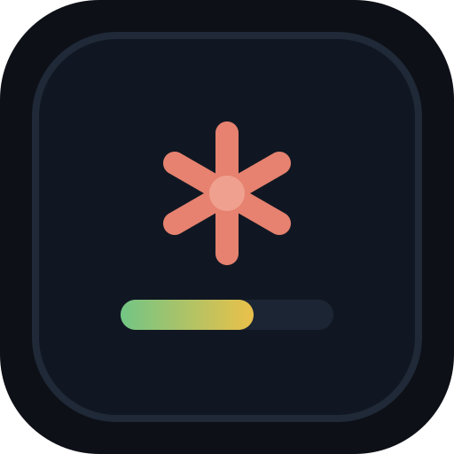
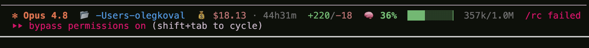

<p align="center">
  <a href="https://github.com/oleg-koval/glint/actions/workflows/ci.yml"></a>
  <a href="LICENSE"></a>
  
  
  <a href="CHANGELOG.md"></a>
</p>

<p align="center">
  
</p>

<h1 align="center">glint</h1>

<p align="center">
  A rich, fast, fail-safe status line for <a href="https://docs.claude.com/en/docs/claude-code">Claude Code</a>.<br>
  <strong>Your whole session at a glance — with a live context gauge.</strong>
</p>

---

<p align="center">
  
</p>

Every Claude Code render, `glint` reads the session JSON and paints one tidy, colorful line: which model you're on, where you are, what it's costing, and — the part nobody else has — **how full your context window is, live, with a gradient gauge.** You see compaction coming instead of getting surprised by it.

Segments are **grouped by topic** — `session ┃ place ┃ change ┃ budget ┃ rest` — separated by a dim bar, so your eye lands on the group it wants instead of scanning one long row. The last group is the part that isn't about the machine: **a break reminder that appears once you've been working too long without stopping.**

One Python file. Zero dependencies. ~75 ms per render. Never crashes your status bar.

> **New in v1.1.0** — topic groups, a break reminder, the open-PR segment, cache-hit ratio, quota pace, and gauges that are now opt-in. See the [changelog](CHANGELOG.md).

## Features

| Segment | Shows | Detail |
|---------|-------|--------|
| ✻ **Model** | `S4.6` | Active model, coral & bold, abbreviated to a family letter + version (`Sonnet 4.6` → `S4.6`, `Opus 4.8` → `O4.8`) |
| **Effort** | `H` | Reasoning effort, colored by what it costs you: `L`/`M` green, `H` gold, `X`/`MAX` bold red. Hidden on models that don't support effort |
| ⏩ **Fast mode** | `⏩` | Shown when fast mode is on |
| 📁 **Directory** | `my-repo` | Workspace basename, `~` for home |
| 🌳 **Worktree** | `wt-refactor` | Active git worktree — from the payload's `worktree.name`, or detected via git on older versions. Hidden unless it differs from the directory segment, so normal repos stay quiet |
| 🌿 **Git** | `main ●3 ↑1 ↓2` | Branch + uncommitted count + ahead/behind upstream. **Green when clean, yellow when dirty** |
| 💰 **Cost · time** | `$0.42 · 4m` | Session spend and duration. **Green < $1, gold < $5, red beyond** |
| **Lines** | `+1.2k/-340` | Lines added / removed this session, `k`-shortened |
| 🧠 **Context** | `75% 150k/200k → 50k left` | **Live** token usage. Gradient **green → yellow → red** as you fill up. From 70% a `→ 50k left` runway countdown appears; from 85% it turns into a bold red `⚠ 12k left` so you compact before you're forced to |
| ♻️ **Cache hit** | `♻️ 94%` | Share of your context served from prompt cache (cache reads are ~10x cheaper than fresh input). **Green ≥ 80%, yellow ≥ 50%, red below** |
| ⏱📅 **Rate limits** | `⏱5h 88% ↻59m ⚡110%` | Session (5h) and weekly (7d) rate-limit usage, same gradient, plus `↻` time until each window resets. Hidden if your plan doesn't report them |
| 🪑☕🛑 **Rest** | `☕ 52m break` | Minutes of **unbroken work**, hidden until 30 of them. Dim `🪑 34m` while you're fine, `☕ 52m break` at 50 minutes, bold red `🛑 1h35m stand up` at 90 — each rung says what it wants, and the later ones survive a narrow line where the cost segment gets dropped. Reset it by walking away for 10 minutes, or tell it directly with `--rested` |
| ▕███░░▏ **Gauges** | `36% ▕███░░░░░▏` | **Opt-in** (`GLINT_BARS=1`). Draws a block gauge beside the context and rate-limit percentages. Off by default: the colour already carries the signal, and the blocks cost ~10 columns a narrow window would rather spend on a segment |
| ⚡ **Pace** | `⚡110%` | Appears **only when you're burning faster than the window elapses**: the share of quota you'd need by reset at the current rate. `⚡110%` = you run out ~10% early. Yellow past 105%, bold red past 150% |

Every segment is independent and **degrades gracefully** — no git repo hides the branch, no cost data hides the money, missing rate-limit data hides those windows. A hard failure falls back to a bare `✻ Claude` so your prompt is never blank.

## Installation

One line — downloads `glint.py` into `~/.claude` and wires the status line for you:

```bash
curl -fsSL https://raw.githubusercontent.com/oleg-koval/glint/main/install.sh | bash
```

The installer asks one question — whether you want the opt-in `▕███░░▏` gauges next to the percentages — and writes `GLINT_BARS=1` into your settings if you say yes. Decide up front and it won't ask:

```bash
curl -fsSL https://raw.githubusercontent.com/oleg-koval/glint/main/install.sh | bash -s -- --bars
curl -fsSL https://raw.githubusercontent.com/oleg-koval/glint/main/install.sh | bash -s -- --no-bars
```

With no terminal attached (CI, provisioning) it keeps the default and stays quiet. Restart Claude Code (or start a new session) and it's live.

<details>
<summary>Manual install</summary>

```bash
# 1. grab the script
curl -fsSL https://raw.githubusercontent.com/oleg-koval/glint/main/glint.py -o ~/.claude/glint.py

# 2. point Claude Code at it — add this to ~/.claude/settings.json
#    "statusLine": { "type": "command", "command": "python3 \"/Users/you/.claude/glint.py\"" }
```
</details>

## How it works

Claude Code runs your `statusLine.command` on every render and pipes it a JSON blob describing the session ([docs](https://docs.claude.com/en/docs/claude-code/statusline)). `glint` parses that blob, runs a couple of sub-second `git` calls, and reads two more things:

- **Context gauge** — the payload's `context_window.context_window_size` is authoritative and already reflects a 1M window, so `glint` trusts it whenever it's present and never guesses the limit. `used_percentage` is null until the first turn; the percentage is derived from the token count then. On older Claude Code versions without the field at all, it falls back to reading the **last main-thread assistant turn** from your transcript and summing its input-side tokens (`input + cache_creation + cache_read`). Sub-agent (sidechain) turns are skipped on purpose, so the gauge always reflects *your* context, never a delegate's.
- **Rate limit bars** — read straight from `rate_limits.five_hour` / `rate_limits.seven_day` when your plan reports them. There's no monthly window in the payload, so `glint` doesn't fabricate one.
- **Pace** — compares quota used against how much of the window has elapsed (derived from `resets_at`), and projects that rate forward to the reset. It stays hidden while you're on track, and for the first 5% of a window where a handful of tokens would extrapolate to nonsense.
- **Worktree** — prefers the payload's `worktree.name`, falling back to `workspace.git_worktree`; without either, a linked worktree is detected by comparing `--absolute-git-dir` against `--git-common-dir`.
- **Effort and fast mode** — read from `effort.level` and `fast_mode`. Effort is only sent for models that support it, so an absent value hides the badge rather than assuming a default.

## Configuration

**Toggles** — environment variables, so you can set them once in `~/.claude/settings.json` under `env`, or per-shell:

| Variable | Default | Effect |
|----------|---------|--------|
| `GLINT_BARS` | off | `1` adds the `▕███░░▏` gauges beside the context and rate-limit percentages |
| `GLINT_REST` | on | `0` hides the break reminder entirely |
| `GLINT_REST_NUDGE` | `50` | Minutes of unbroken work before the yellow `☕`. The red `🛑` follows at 1.8× it; the quiet `🪑` starts at 60% of it **or 30 minutes, whichever is sooner** (so raising the nudge doesn't hide the clock for an hour) |
| `GLINT_REST_SHOW` / `GLINT_REST_HARD` | `30` / `90` | Override those two derived thresholds directly |
| `GLINT_REST_GAP` | `10` | Minutes of no renders that count as a break and reset the clock |
| `GLINT_REST_STATE` | temp dir | Where the work clock is kept (one file per user, shared by all your windows) |
| `GLINT_COST` | on | `0` hides the cost · duration segment |
| `GLINT_LINES` | on | `0` hides lines added/removed |
| `GLINT_CACHE` | on | `0` hides the cache-hit ratio |
| `GLINT_RATELIMITS` | on | `0` hides the 5h/7d windows |
| `GLINT_WORKTREE` | on | `0` hides the worktree segment |
| `GLINT_PR` | on | `0` disables the open-PR lookup |

Segment switches are on unless set to `0`/`false`/`no`/`off`; `GLINT_BARS` is the mirror — off unless set to `1`/`true`/`yes`/`on`.

Beyond that, `glint` is intentionally a single readable file — tweak it directly:

- **Colors** — the `# 256-color palette` block at the top maps every segment to an xterm-256 code.
- **Cost thresholds** — `money_color = GREEN if money < 1 else GOLD if money < 5 else RED`.
- **Context bands** — `gc = GREEN if pct < 0.6 else YELLOW if pct < 0.85 else RED`.
- **Runway thresholds** — `pct >= 0.85` (red `⚠ …left`) and `pct >= 0.7` (yellow `→ …left`) in the context gauge segment.
- **Cache-hit bands** — `ratio >= 0.8` green, `>= 0.5` yellow in the cache segment.
- **Effort badges** — the `_EFFORT` map sets the letter and color for each level.
- **Pace sensitivity** — `p > 1.05` to show the marker, `p > 1.5` to turn it bold red; `elapsed < 0.05` is the young-window cutoff in `pace()`.
- **Gauge width** — the `width` arg of `gauge()` (visible with `GLINT_BARS=1`).
- **Topic groups** — the `GRP_*` constants assign each segment to a group, and `group_sep()` draws the `  ┃  ` divider (colour `RULE`) between them; `sep()` is the tighter gap used inside a group.
- **Rest thresholds** — `REST_SHOW` / `REST_NUDGE` / `REST_HARD` / `REST_GAP` at the top of the rest block, all overridable by env (see the table above).
- **Icons** — emoji are used so they render on any terminal without a Nerd Font. Swap them for Nerd Font glyphs if you have one installed.

## The break reminder

Long uninterrupted sitting is the part of this job that no status line usually shows you, so `glint` tracks it the only way it can: Claude Code renders on activity, so the **gap between two renders is idle time**. Ten quiet minutes counts as a break and the clock restarts; anything shorter just keeps counting. One clock per user, shared across windows — it's one body, however many terminals it has open.

The thresholds aren't a single method, they're where three lines of evidence agree:

- **30 min** (`🪑`, dim) — sedentary-behaviour research finds the harm is in *uninterrupted* sitting rather than sitting per se, and the experimental work on breaking it up (short interruptions every ~20–30 min) is where the common "get up twice an hour" ergonomics advice comes from. WHO's activity guidelines say to limit sedentary time without naming an interval. At this point you're only being told the clock is running.
- **50 min** (`☕`, yellow) — close to the ~52-minutes-on / 17-off rhythm DeskTime found among its most productive users, and roughly where sustained-attention studies see vigilance start to slide.
- **90 min** (`🛑`, bold red) — one full ultradian cycle. Past it you're paying fatigue to stay in the chair, and the honest fix is to stand up, not to push.

### Telling it you took the break

Walking away for ten minutes resets the clock by itself. A shorter stretch break doesn't, so there's a button for it:

```bash
python3 ~/.claude/glint.py --rested        # ☕ break logged — work clock back to zero
python3 ~/.claude/glint.py --rest-status   # 42 min since your last break (nudge at 50)
```

Worth an alias — `alias rested='python3 ~/.claude/glint.py --rested'` — and inside Claude Code you can run it without leaving the session by typing `!rested`. The reminder disappearing is the receipt.

Treat them as defaults, not doctrine — `GLINT_REST_NUDGE=40` moves the whole ladder. And while you're up: the eye-strain counterpart, the **20-20-20 rule** (every 20 minutes, look ~20 ft away for 20 s), is worth doing at every one of these stops.

## Requirements

- **Claude Code** with status-line support
- **Python 3.8+** (standard library only — no `pip install`)
- **git** (optional; the branch segment simply hides without it)

## Upgrading

Re-run the installer — it overwrites `~/.claude/glint.py` and leaves your settings alone:

```bash
curl -fsSL https://raw.githubusercontent.com/oleg-koval/glint/main/install.sh | bash
```

What changed between versions is in [CHANGELOG.md](CHANGELOG.md).

## Uninstall

Remove the `"statusLine"` block from `~/.claude/settings.json` and delete `~/.claude/glint.py`.

## Why it's safe

- **No dependencies** — pure standard library, nothing to audit or update.
- **Read-only** — it reads session JSON, the transcript, and `git` state. It never writes to your repo or your project.
- **Bounded** — `git` calls time out at 1 s; a top-level `try/except` guarantees the status line can never break your prompt.

## Contributing

Issues and PRs welcome — see [CONTRIBUTING.md](CONTRIBUTING.md). It's one file; keep it that way.

## License

[MIT](LICENSE) © Oleg Koval

<p align="center">
  <sub><a href="https://github.com/oleg-koval/glint">GitHub</a> · <a href="https://github.com/oleg-koval/glint/issues">Issues</a> · built for <a href="https://docs.claude.com/en/docs/claude-code">Claude Code</a></sub>
</p>
